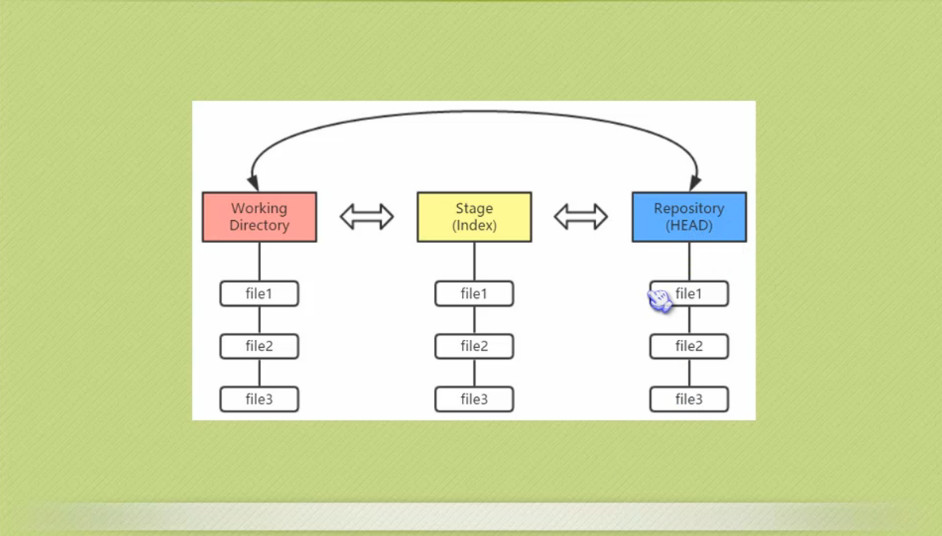
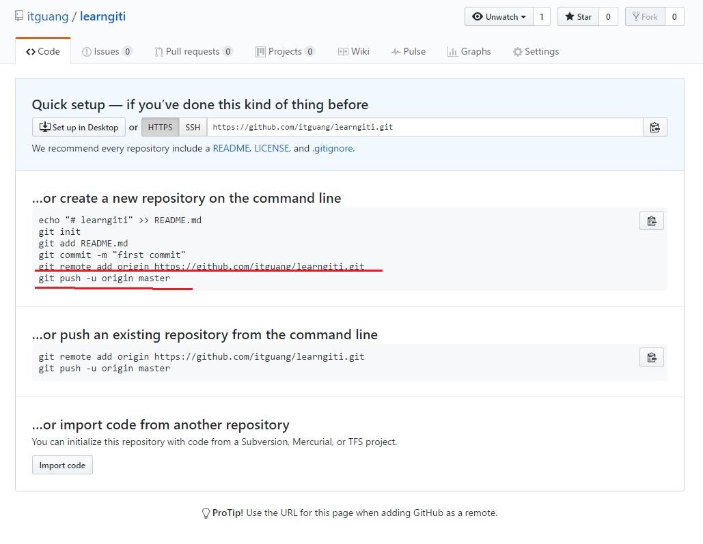

> 本篇教程使用linux 系统讲解,你也可以在windows下安装git,所有git命令都适用
> 

# linux下如何安装git
> 如果你碰巧用Debian或Ubuntu Linux，通过一条sudo apt-get install git就可以直接完成Git的安装,其他版本请自行去官网下载安装包


## 创建版本库
> git init  //通过git init命令把这个目录变成Git可以管理的仓库

初始化一个Git仓库，使用git init命令。

添加文件到Git仓库，分两步：

> git add readme.txt   //将readme.txt文件添加到仓库

    第一步，使用命令git add <file>，注意，可反复多次使用，添加多个文件；

> git commit   //用命令git commit告诉Git，把文件提交到仓库：

    第二步，使用命令git commit，完成。

## 查看文件改动信息

>  git status
提交了一个文件之后,我们又做了一些改动,我们可以使用 git status 查看改动信息

git status命令可以让我们时刻掌握仓库当前的状态，

> git diff

如果要看看具体修改了什么内容 可以使用 git diff 命令

git diff顾名思义就是查看difference，显示的格式正是Unix通用的diff格式


```git
小结

要随时掌握工作区的状态，使用git status命令。

如果git status告诉你有文件被修改过，用git diff可以查看修改内容

```

# 版本回退

> git log                      //查看提交的历史记录

版本控制系统肯定有某个命令可以告诉我们历史记录，在Git中，我们用git log命令查看：

git log命令显示从最近到最远的提交日志

> git reset --hard HEAD^       //回退到上一个版本
> 

首先，Git必须知道当前版本是哪个版本，在Git中，用HEAD表示当前版本

一个版本就是HEAD^，上上一个版本就是HEAD^^，当然往上100个版本写100个^比较容易数不过来，所以写成HEAD~100。

> git reflog  //查看历史命令


Git提供了一个命令git reflog用来记录你的每一次命令：

```git
小结

现在总结一下：

HEAD指向的版本就是当前版本，因此，Git允许我们在版本的历史之间穿梭，使用命令git reset --hard commit_id。

穿梭前，用git log可以查看提交历史，以便确定要回退到哪个版本。

要重返未来，用git reflog查看命令历史，以便确定要回到未来的哪个版本。

```

## 工作区和暂存区

> 工作区（Working Directory）

就是你在电脑里能看到的目录，比如我的learngit文件夹就是一个工作区：

工作区有一个隐藏目录.git，这个不算工作区，而是Git的版本库。

> 版本库（Repository）

Git的版本库里存了很多东西，其中最重要的就是称为stage（或者叫index）的暂存区，还有Git为我们自动创建的第一个分支master，以及指向master的一个指针叫HEAD。




前面讲了我们把文件往Git版本库里添加的时候，是分两步执行的：

    第一步是用git add把文件添加进去，实际上就是把文件修改添加到暂存区；

    第二步是用git commit提交更改，实际上就是把暂存区的所有内容提交到当前分支。

因为我们创建Git版本库时，Git自动为我们创建了唯一一个master分支，所以，现在，git commit就是往master分支上提交更改。

你可以简单理解为，需要提交的文件修改通通放到暂存区，然后，一次性提交暂存区的所有修改。

```git
小结

暂存区是Git非常重要的概念，弄明白了暂存区，就弄明白了Git的很多操作到底干了什么。

没弄明白暂存区是怎么回事的童鞋，请向上滚动页面，再看一次。

```

## 管理修改

> 每次修改，如果不add到暂存区(staged)，那就不会加入到commit中。

## 撤销修改

```git
小结

又到了小结时间。

* 场景1：当你改乱了工作区某个文件的内容，想直接丢弃工作区的修改时，用命令git checkout -- file。

* 场景2：当你不但改乱了工作区某个文件的内容，还添加到了暂存区时，想丢弃修改，分两步，第一步用命令git reset HEAD file，就回到了场景1，第二步按场景1操作。

* 场景3：已经提交了不合适的修改到版本库时，想要撤销本次提交，参考版本回退一节，不过前提是没有推送到远程库。

```


## 删除文件

小结

    命令git rm用于删除一个文件。如果一个文件已经被提交到版本库，那么你永远不用担心误删，但是要小心，你只能恢复文件到最新版本，你会丢失最近一次提交后你修改的内容。

## 远程仓库
首先在github上新建一个仓库



        echo "# learngiti" >> README.md
        git init //初始化一个本地仓库
        git add README.md //把README.md 添加到 staged 中
        git commit -m "first commit" // 提交到本地仓库
        git remote add origin https://github.com/itguang/learngiti.git //提交到远程仓库,远程库的名字就是origin，这是Git默认的叫法，也可以改成别的，但是origin这个名字一看就知道是远程库。
                    // 使用https协议的地址不需要 ssh key
                    //使用ssh协议的地址需要 ssh key
        git push -u origin master //把本地库的所有内容推送到远程库上,  期间会让你输入你的github用户名和密码

把本地库的内容推送到远程，用git push命令，实际上是把当前分支master推送到远程。

由于远程库是空的，我们第一次推送master分支时，加上了-u参数，Git不但会把本地的master分支内容推送的远程新的master分支，还会把本地的master分支和远程的master分支关联起来，在以后的推送或者拉取时就可以简化命令。

推送成功后，可以立刻在GitHub页面中看到远程库的内容已经和本地一模一样：

从现在起，只要本地作了提交，就可以通过命令：

        $ git push origin master

把本地master分支的最新修改推送至GitHub，现在，你就拥有了真正的分布式版本库！


## 添加远程仓库

小结

    要关联一个远程库，使用命令git remote add origin git@server-name:path/repo-name.git；

    关联后，使用命令git push -u origin master第一次推送master分支的所有内容；

    此后，每次本地提交后，只要有必要，就可以使用命令git push origin master推送最新修改；

    分布式版本系统的最大好处之一是在本地工作完全不需要考虑远程库的存在，也就是有没有联网都可以正常工作，而SVN在没有联网的时候是拒绝干活的！当有网络的时候，再把本地提交推送一下就完成了同步，真是太方便了！

## 从远程库克隆

使用https协议的地址不需要 ssh key

使用ssh协议的地址需要 ssh key

使用https除了速度慢以外，还有个最大的麻烦是每次推送都必须输入口令

小结

    要克隆一个仓库，首先必须知道仓库的地址，然后使用git clone命令克隆。

    Git支持多种协议，包括https，但通过ssh支持的原生git协议速度最快。

## 分支管理

分支在实际中有什么用呢？假设你准备开发一个新功能，但是需要两周才能完成，第一周你写了50%的代码，如果立刻提交，由于代码还没写完，不完整的代码库会导致别人不能干活了。如果等代码全部写完再一次提交，又存在丢失每天进度的巨大风险。

现在有了分支，就不用怕了。你创建了一个属于你自己的分支，别人看不到，还继续在原来的分支上正常工作，而你在自己的分支上干活，想提交就提交，直到开发完毕后，再一次性合并到原来的分支上，这样，既安全，又不影响别人工作。

## 创建与合并分支

小结

    Git鼓励大量使用分支：

    查看分支：git branch

    创建分支：git branch <name>

    切换分支：git checkout <name>

    创建+切换分支：git checkout -b <name>

    合并某分支到当前分支：git merge <name>

    删除分支：git branch -d <name>


## 解决冲突

小结

    当Git无法自动合并分支时，就必须首先解决冲突。解决冲突后，再提交，合并完成。

    用git log --graph命令可以看到分支合并图。


## 分支管理策略
[分支管理策略](http://www.liaoxuefeng.com/wiki/0013739516305929606dd18361248578c67b8067c8c017b000/0013758410364457b9e3d821f4244beb0fd69c61a185ae0000)

Git分支十分强大，在团队开发中应该充分应用。

合并分支时，加上--no-ff参数就可以用普通模式合并，合并后的历史有分支，能看出来曾经做过合并，而fast forward合并就看不出来曾经做过合并。

## Bug分支

[Bug分支](http://www.liaoxuefeng.com/wiki/0013739516305929606dd18361248578c67b8067c8c017b000/00137602359178794d966923e5c4134bc8bf98dfb03aea3000)

小结

    修复bug时，我们会通过创建新的bug分支进行修复，然后合并，最后删除；

    当手头工作没有完成时，先把工作现场git stash一下，然后去修复bug，修复后，再git stash pop，回到工作现场。

## Feature分支

[](http://www.liaoxuefeng.com/wiki/0013739516305929606dd18361248578c67b8067c8c017b000/001376026233004c47f22a16d1f4fa289ce45f14bbc8f11000)

小结

    开发一个新feature，最好新建一个分支；

    如果要丢弃一个没有被合并过的分支，可以通过git branch -D <name>强行删除。


## 多人协作

小结

    * 查看远程库信息，使用git remote -v；

    * 本地新建的分支如果不推送到远程，对其他人就是不可见的；

    * 从本地推送分支，使用git push origin branch-name，如果推送失败，先用git pull抓取远程的新提交；

    * 在本地创建和远程分支对应的分支，使用git checkout -b branch-name origin/branch-name，本地和远程分支的名称最好一致；

    * 建立本地分支和远程分支的关联，使用git branch --set-upstream branch-name origin/branch-name；

    * 从远程抓取分支，使用git pull，如果有冲突，要先处理冲突。

## 创建标签

**小结**

    命令git tag <name>用于新建一个标签，默认为HEAD，也可以指定一个commit id；

    git tag -a <tagname> -m "blablabla..."可以指定标签信息；

    git tag -s <tagname> -m "blablabla..."可以用PGP签名标签；

    命令git tag可以查看所有标签。


## 操作标签

[操作标签](http://www.liaoxuefeng.com/wiki/0013739516305929606dd18361248578c67b8067c8c017b000/001376951885068a0ac7d81c3a64912b35a59b58a1d926b000)

**小结**

    命令git push origin <tagname>可以推送一个本地标签；

    命令git push origin --tags可以推送全部未推送过的本地标签；

    命令git tag -d <tagname>可以删除一个本地标签；

    命令git push origin :refs/tags/<tagname>可以删除一个远程标签。

## 使用GitHub


如何参与一个开源项目呢？比如人气极高的bootstrap项目，这是一个非常强大的CSS框架，你可以访问它的项目主页https://github.com/twbs/bootstrap，点“Fork”就在自己的账号下克隆了一个bootstrap仓库，然后，从自己的账号下clone：

git clone git@github.com:michaelliao/bootstrap.git
一定要从自己的账号下clone仓库，这样你才能推送修改。如果从bootstrap的作者的仓库地址git@github.com:twbs/bootstrap.git克隆，因为没有权限，你将不能推送修改

Bootstrap的官方仓库twbs/bootstrap、你在GitHub上克隆的仓库my/bootstrap，以及你自己克隆到本地电脑的仓库，他们的关系就像下图显示的那样：


如果你想修复bootstrap的一个bug，或者新增一个功能，立刻就可以开始干活，干完后，往自己的仓库推送。

如果你希望bootstrap的官方库能接受你的修改，你就可以在GitHub上发起一个pull request。当然，对方是否接受你的pull request就不一定了。

如果你没能力修改bootstrap，但又想要试一把pull request，那就Fork一下我的仓库：https://github.com/itguang/learngit，创建一个your-github-id.txt的文本文件，写点自己学习Git的心得，然后推送一个pull request给我，我会视心情而定是否接受。

小结

    在GitHub上，可以任意Fork开源仓库；

    自己拥有Fork后的仓库的读写权限；

    可以推送pull request给官方仓库来贡献代码。